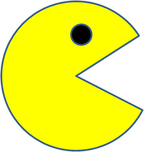

# PacMen
## PacMen Exercise

This project uses javascript, html and images files to create interactive mouseclick buttons to call a factory function to create the "PacMan" image upon every click.  The second button animates those images using programatic coding to define velocity and direction. 
